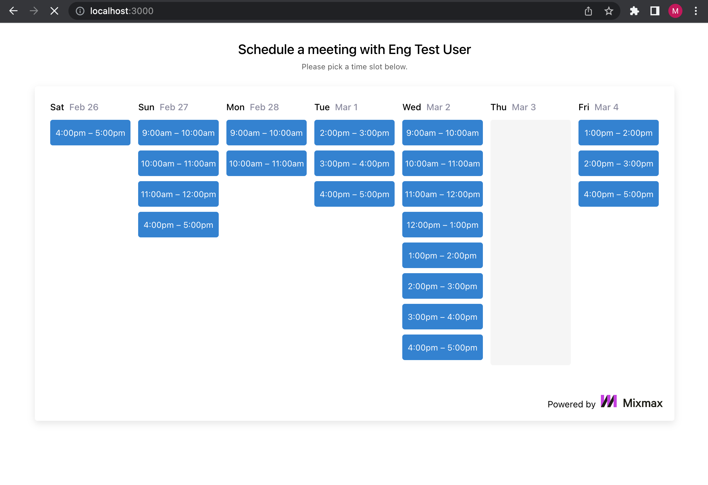

# Introduction

In this this exercise you're finishing the client-side implementation for a simplified version of [Mixmax's Calendar feature](https://www.mixmax.com/calendar). See an example calendar [here](https://cal.mixmax.com/demo/30).

The purpose of this feature is to allow a guest to book a meeting on a Mixmax user's calendar.

You'll complete the challenge below. The whole exercise should take you around 1 hour. Your deadline is 3 days after you first receive this. Please return your solution by zip/tgz file in the same email thread.

# Setup

After unpacking the zip/tgz file, run the following:

```
cd package
npm install
npm start
```

Then open <http://localhost:3000/> in your browser.

When you're done, you can create a `.tgz` file to send back by running `npm pack`.

# File Structure

`./client` - Client browser files. You will need to edit these files.

`./docs` - Files for the README. You do not need to edit this.

`./mock` - Mock database. You do not need to edit this.

`./server` - Mock server. You do not need to edit this.

Feel free to create files and directories as you see fit.

# Specifications

Once you open <http://localhost:3000/> you'll see an incomplete implementation. Your job is to finish the implementation style it _identical_ to the screenshot below, and in accordance with these specifications.

1. In the `client/App.js` file, you'll see there's a `fetch` request. It is retrieving data from the mocked API in `server/index.js`. You will need to use this data to render available timeslots instead of the hardcoded days and times.

2. For this challenge, you have to iterate over the `timeslots` object to be able to achieve the following:

    1. Group slots by day
    2. Render the slots for the next 7 days starting tomorrow. Each slot should have the length determined by the `timeslotLengthMinutes` returned by the server.
    3. Your page matches the below design. You can also get exact pixel measurements from the production version of the calendar [here](https://cal.mixmax.com/demo/30).

3. There is also a rendering bug in the initial implementation that you'll need to find and fix accordingly.

At the conclusion of the exercise, your calendar should show the time slots, each one with one hour range, on which our host is available. Your solution should be styled _identical_ (eg heading, fonts, spacing, sizing) to the mock presented below:


